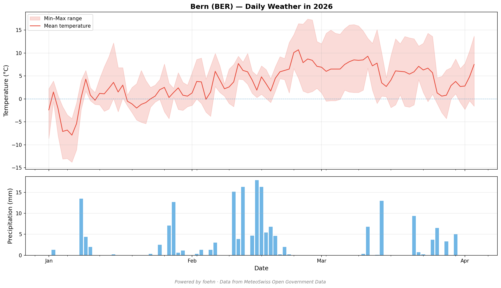

# MCP Server

foehn includes an [MCP server](https://modelcontextprotocol.io) that gives LLMs live access to MeteoSwiss data. It is published on the [MCP Registry](https://registry.modelcontextprotocol.io).

<p align="center">
  
</p>
<p align="center">
  <em>Daily weather in Bern, powered by foehn's MCP server and MeteoSwiss open data.</em>
</p>

---

## Installation

```bash
pip install "foehn[mcp]"
```

---

## Configuration

Add foehn to your MCP client config:

```json
{
  "mcpServers": {
    "foehn": {
      "command": "foehn",
      "args": ["mcp"]
    }
  }
}
```

---

## Available tools

| Tool | Description |
|---|---|
| `list_datasets` | Browse all MeteoSwiss datasets with metadata |
| `load_data` | Fetch weather measurements as rows |
| `describe_data` | Get summary statistics for a dataset |
| `get_parameters` | Look up what each column measures |
| `get_stations` | Find station abbreviations and locations |
| `get_inventory` | Check data availability per station |
